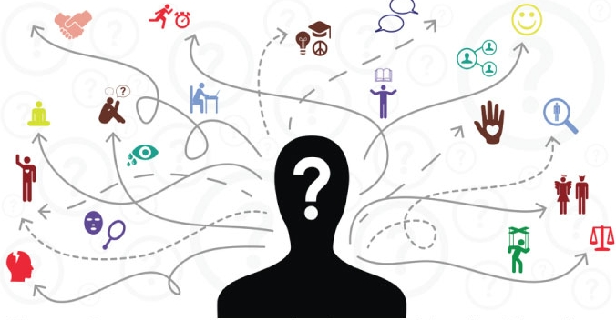

<html>
<head>
  
</head>
<body>

  

# jtap
JTAP (Java Activity-Based Planner) is a framework that allows for the design of models representing persons' decisional processes based on their needs. These latter are considered as behavioral targets specific to each individual. Models that the framework supports are deep learning models and statistical models. Customized optimization algorithms, as well as external solvers, can be used to simulate the learning process.       

</body>
</html>
